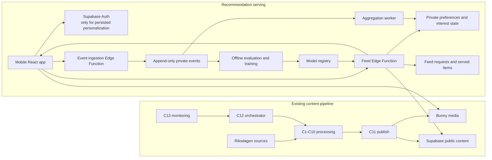

# Riket TV recommendation system launch plan

**Status:** Proposed architecture and delivery plan

**Last updated:** 2026-08-02

**Scope:** From published clips in Supabase to a measurable, privacy-gated, personalized mobile feed. This plan does not redesign the C1-C11 clip-production pipeline.

## Executive decision

Build the recommender as a separate online serving system after C11, not as an extension of C7.

- C7 answers: **which moments are good enough to publish?**
- The feed answers: **which already-published clip should this viewer see next, in this session?**

Those systems have different data, objectives, failure modes, and training units. C7 selection/ranking should remain deterministic and auditable; its optional title enrichment remains a separate guarded step. The feed may use C7 output as one content-quality input, but it must own viewer context, freshness, exposure logging, diversity, experiments, and consent enforcement.

The recommended launch is deliberately evolutionary:

1. Close the current database privilege risk and establish additive migrations.
2. Finish C12 orchestration and C13 observability so new content arrives continuously.
3. Ship a good non-personalized `Senaste` feed plus trustworthy exposure/event instrumentation.
4. Ship a deterministic, consent-gated `För dig` ranker using explicit choices and simple session/history signals.
5. Add content topics and similarity retrieval.
6. Train a learned ranker only after the exposure data is complete and large enough.

Do not wait for machine learning to launch personalization. At the current scale—16 published test clips and no production exposure denominator—a learned model would mostly learn noise and implementation bias.

## Current baseline

| Area | What exists | Launch implication |
|---|---|---|
| Clip supply | C1-C11 are complete; Bunny stores media and Supabase stores published metadata and all C6 candidates | The recommender can consume C11 rows without changing `src/contracts.py` |
| Continuous operation | C12 orchestration and C13 observability are still TODO | Freshness cannot be a product promise until unattended discovery, retry, and alerting work |
| Feed | `loadPublishedClips()` reads 60 clips directly from Supabase ordered by `published_at DESC` | This is a catalogue query, not a personalized feed service |
| Feed modes | `För dig` and `Senaste` toggle React state but use the same clip array and order | The modes are currently cosmetic |
| Viewer state | Likes, saves, follows, party choices, and consent toggles exist only in React memory | Nothing currently survives reload or affects ranking |
| Consent | Personalization and email switches default to `true`; no proof, version, timestamp, or server enforcement exists | The current UI is a mockup, not valid recorded consent |
| Telemetry | `engagement_events` has watch milliseconds and a few nullable booleans | It lacks requests, served items, impressions, positions, event types, versions, and idempotency |
| Content understanding | Party, politician, debate type, transcript, archetype, and C7 features exist; `topic` is normally `null` | Enough for a rules-based MVP, not yet enough for strong topic or semantic matching |
| Exploration | `clip_features.was_explore` exists but C11 always writes `false` | Publishing exploration and feed exploration are both unimplemented and must remain distinct |
| Security | `publish_clip_batch(jsonb)` is `SECURITY DEFINER` and the migration grants `service_role` but does not revoke default `PUBLIC` execution | Verify the deployed privilege immediately and revoke it with an additive migration before further launch work |

Two existing fields must be interpreted carefully:

- Use `sources.debate_date` as the primary age of the political content. Use `clips.published_at` as the time it became available in the app. An old debate backfilled today must not appear as breaking news.
- Do not compare raw C7 `final_score` values globally. C7 deliberately z-scores many features within a speech, so a score from one speech is not automatically comparable with a score from another. The feed needs a calibrated quality prior or can initially use rank, absolute gate features, and observed engagement.

## Recommended system boundary



The React app should be a thin renderer of server-ranked results. It must not contain secret keys, calculate the authoritative rank, or write directly into sensitive tables.

Supabase is a good fit for the first serving layer because the project already uses Postgres and a static Vite host. Supabase supports authenticated [Edge Functions](https://supabase.com/docs/guides/functions/auth), [anonymous Auth users](https://supabase.com/docs/guides/auth/auth-anonymous), and user-scoped [row-level security](https://supabase.com/docs/guides/database/postgres/row-level-security). Anonymous Auth should be created only under the approved identity/consent design; it is a persistent pseudonymous account, not the same thing as the public `anon` API key, and it needs abuse prevention and cleanup.

## Product behavior

### Two honest feed modes

`Senaste` is the non-profiled control and fallback:

- available without personalization consent;
- ordered primarily by `debate_date DESC`, then `published_at DESC`;
- optionally de-duplicated by speech/speaker for usability, but never uses a viewer history or inferred profile;
- clearly labels the debate date and links to the Riksdagen source.

`För dig` is the consented personalized feed:

- combines explicit onboarding choices, follows, recent qualified viewing, content similarity, freshness, and controlled exploration;
- has a visible “Why this clip?” reason;
- exposes edit interests, not interested, reset recommendations, and turn off personalization controls;
- falls back immediately to a non-profiled feed when consent is absent or withdrawn.

### Candidate retrieval pools

Do not ask one global score to solve freshness, personalization, back-catalog use, and diversity simultaneously. Retrieve separate pools, score within them, then mix a slate.

1. `fresh_interest` — recent clips matching selected or learned parties, politicians, and topics.
2. `fresh_general` — recent high-quality clips outside the strongest interests, so new parliamentary activity is not hidden.
3. `back_catalog_interest` — unseen older clips with strong interest or semantic similarity.
4. `adjacent_interest` — related topics or speakers that broaden the profile without being random.
5. `explore` — controlled random candidates with sufficient quality, used to learn and prevent a closed loop.

For the first ten `För dig` positions, start with this versioned policy when inventory permits:

| Pool | Provisional slots | Purpose |
|---|---:|---|
| Fresh + matching interest | 5 | Satisfy the user’s stated interests with current material |
| Fresh + general/diverse | 2 | Keep the feed connected to what Parliament is doing now |
| Older + matching interest | 2 | Use the back catalogue without overwhelming current material |
| Adjacent/exploration | 1 | Learn new interests and avoid a self-sealing filter bubble |

If a pool is empty, fill from the next most relevant pool and log the fallback reason. This 5/2/2/1 split is a launch hypothesis, not a permanent editorial law. It should be controlled by an algorithm version and tested.

### Ranking within each pool

Use an explainable V1 score with every component normalized to `[0, 1]`:

```text
score_v1 =
    0.30 * explicit_interest
  + 0.20 * behavioural_affinity
  + 0.15 * semantic_similarity
  + 0.15 * calibrated_quality
  + 0.10 * freshness
  + 0.05 * age_normalized_trend
  + 0.05 * discovery_bonus
```

At first launch, redistribute any unavailable behavioural, semantic, or trend weight across explicit interest, freshness, and quality. F2/F3 may activate behavioural affinity and age-normalized trend only after their versioned viewer/item aggregates pass reconciliation checks. Keep the score components in the served-item log so every ranking can be reconstructed.

Important details:

- Freshness should decay from the actual debate date, with `published_at` used only for availability/tie-breaking. Do not hardcode a single half-life across all content; `Frågestund` and a long-lived policy explanation age differently.
- Popularity must be age-normalized and Bayesian-smoothed. Raw lifetime views would permanently privilege old winners and starve new clips.
- “Content quality” is not raw C7 `final_score`. Start with the publish gate, `rank_in_speech`, absolute framing/comprehensibility features, and a calibrated percentile by archetype/debate type.
- Missing signals must be neutral, not zero. A new clip or new user should not be penalized for having no history.
- Never infer or name a person’s party allegiance. Store only scoped content affinities needed to rank the feed.

### Slate constraints

After scoring, greedily rerank the page with constraints. The initial defaults should be configurable and logged:

- never repeat the same clip within a session;
- suppress previously completed clips for a configurable cooldown;
- no adjacent clips from the same speaker;
- at most two clips from one speech in a page, preferably one;
- soft cap of two clips from one speaker in ten;
- soft cap of three clips from one party in ten unless an explicit user choice justifies relaxing it;
- preserve the planned fresh/back-catalog pool allocation;
- prevent one archetype or topic from taking the whole page;
- relax soft caps in a deterministic order when inventory is thin.

Party distribution is a serving-policy decision, not a hidden penalty inside the relevance model. The system should report exposure by party, speaker, topic, and archetype. Product/editorial owners must choose whether the goal is equal exposure, proportional exposure, user-controlled exposure, or only measurement. Until that decision is made, use transparent soft repetition caps rather than claiming political neutrality.

### Back-catalog safety

Older political material is valuable, but resurfacing can make an old claim look current. Add recommendation metadata separate from pipeline contracts:

- `content_at` derived from the debate date;
- `temporal_class`: `current`, `evergreen`, or `historical`;
- optional `valid_until` for time-sensitive claims;
- a reason such as `older_on_topic` or `from_debate_2024`;
- the original date and source shown on every clip.

Until temporal classification exists, limit the back catalogue to two of the first ten slots and always show its date. Never call a newly uploaded backfill “new.”

## Feedback and viewer profiles

### Signals worth learning from

| Signal | Interpretation |
|---|---|
| Foreground watch ratio and qualified watch time | Strong continuous signal; count wall-clock time only while visible and playing |
| Completion at a documented threshold, for example 95% | Positive, normalized for clip duration |
| Deliberate replay | Strong positive; distinguish from automatic looping |
| Like, save, share, follow | Explicit positive actions with different strengths |
| Not interested, unfollow | Explicit negative action; honor immediately |
| Early dismissal after actual playback begins | Weak negative; do not over-interpret accidental scrolls or autoplay failures |
| Seek, mute, pause, buffering | Diagnostics first; not direct preference labels |

Use decayed aggregates rather than keeping an unbounded behavioural dossier. Cap the contribution of one session and decay old affinities. Keep explicit follows/onboarding choices separate from inferred interests so the UI can explain and edit each source.

The current native video `loop` makes completion and replay ambiguous. Replace it with an explicit playback state machine or instrument loop boundaries deliberately. A trustworthy impression should require the clip to be roughly 72% visible for at least one second while the document is visible. Watch time should be wall-clock active playback, not changes in `currentTime`, because seeks and loops corrupt media-time deltas.

### Two exploration loops

Do not conflate these:

- **Publishing exploration:** occasionally publish a C6 candidate that C7 did not rank at the top. This teaches whether the content selector rejected good material. It belongs to `clip_features.was_explore` and is currently always false.
- **Serving exploration:** occasionally show an eligible published clip outside the user’s predicted top results. This teaches user/item preferences and must be logged on the served item with its selection probability.

Both are required to avoid self-reinforcing bias. A boolean is not enough for unbiased evaluation; record the sampling propensity for randomized serving choices.

## API and storage design

### Schema boundaries

Keep published political content in `public`. Put viewer behavior and political-interest profiles in a non-exposed `private` schema, accessed only through authenticated server functions. Service-role code bypasses RLS, so it must derive the subject from the verified JWT and never trust a caller-provided user ID.

Recommended additive tables:

| Table | Essential fields |
|---|---|
| `private.consent_records` | subject, purpose, granted/withdrawn, Article 6 basis, Article 9 condition, notice/version, UI source, timestamps |
| `private.viewer_preferences` | subject, entity type/id, signed weight, `explicit`/`follow`/`inferred`, created/updated/decayed timestamps |
| `private.feed_requests` | request, nullable subject/session, mode, algorithm/model version, experiment snapshot, consent state, request time |
| `private.feed_items` | request, clip, position, pool/reason, score components, exploration probability, opaque event token |
| `private.playback_events` | client event UUID, feed item, event type, client/server times, watch delta, progress, metadata |
| `private.viewer_interest_state` | compact derived party/politician/topic affinities, feature version, updated time |
| `private.experiments` and assignments | experiment, variants, eligibility, stable assignment, start/end/status |
| `private.recommendation_models` | algorithm/model version, feature schema, training window, artifact checksum, status |
| `private.data_subject_requests` | export/reset/delete workflow and completion audit |
| `public.clip_reco_features` or server-only equivalent | normalized topics, embedding/version, quality prior, temporal class |

Do not overload the current wide `engagement_events` row. Preserve it if compatibility requires, but build an append-only, typed, idempotent event stream for recommendation work.

### Feed endpoint

Use an Edge Function or equivalent server endpoint. `latest` may accept only the project publishable credential and must not require a stable viewer identity. `for_you` requires a verified user JWT plus active personalization consent:

```http
POST /feed-requests
```

The body carries `client_request_id`, `mode=for_you|latest`, `cursor`, and `limit`. The client UUID is an idempotency key: a retry returns the same recorded slate rather than creating phantom served items. Use `POST` because serving creates denominator rows; caches and prefetchers must not turn a repeated `GET` into an extra exposure.

Return:

```json
{
  "feed_request_id": "uuid",
  "algorithm_version": "feed-rules-v1",
  "experiment": {"id": "feed-v1", "variant": "treatment"},
  "items": [
    {
      "feed_item_id": "uuid",
      "position": 1,
      "reason": "fresh_interest",
      "event_token": "opaque-signed-value",
      "clip": {
        "id": "clip-id",
        "speech_id": "speech-id",
        "politician_id": "uuid-or-null",
        "speaker_name": "Name",
        "party": "S",
        "content_at": "2026-08-02",
        "published_at": "2026-08-02T10:00:00Z",
        "source": {"title": "Debate", "url": "https://www.riksdagen.se/"}
      }
    }
  ],
  "next_cursor": "opaque"
}
```

Use keyset pagination and a request snapshot. For consented personalization/analytics, log the returned slate transactionally before responding so the training denominator exists even if the client never emits an impression. For a no-consent `latest` request, do not attach the request to a stable subject or retain viewer-level telemetry; keep only the minimal operational data approved for security and reliability.

The production DTO must also carry the existing title/transcript/topic/archetype/media fields. Use the stable Supabase `politician_id` where one exists; never derive follow/preference identity from a display-name slug. The client must render the supplied order unchanged. It may prefetch media, but it must not rerank locally.

### Event endpoint

```http
POST /events/batch
```

- accept a small batch with idempotent client UUIDs;
- require an immutable event purpose and consent version on each event or its referenced feed item;
- validate the JWT/session, event token, clip, feed item, and current consent purpose;
- reject or strip personalization events when consent is absent/withdrawn;
- accept retries without duplicating rows;
- use `fetch(..., {keepalive: true})` as the authenticated page-exit transport; `sendBeacon` cannot attach a Supabase Auth `Authorization` header and is safe only if a separately designed signed event token or secure cookie authenticates that endpoint;
- rate-limit and validate bounds server-side;
- never accept arbitrary score components, subject IDs, or experiment assignments from the browser.

When consent is withdrawn, cancel in-flight personalized feed calls and delete queued client outbox events for that purpose before making the next request.

## Privacy, political-content, and trust gate

This is architecture input, not a later copywriting task.

Party preferences and inferred political interests should be treated as special-category political-opinion data. GDPR Article 9 generally prohibits processing data revealing political opinions unless an exception applies. Every operation also needs an Article 6 lawful basis; explicit consent may provide Article 6(1)(a) plus the Article 9(2)(a) exception, but have counsel confirm the exact analysis. Do not assume another Article 9 exception. See [GDPR Articles 6 and 9](https://eur-lex.europa.eu/eli/reg/2016/679/2016-05-04/eng), [IMY on sensitive personal data](https://www.imy.se/verksamhet/dataskydd/det-har-galler-enligt-gdpr/introduktion-till-gdpr/personuppgifter/kansliga-personuppgifter/), and the EDPB’s [targeting guidance](https://www.edpb.europa.eu/system/files/2021-04/edpb_guidelines_082020_on_the_targeting_of_social_media_users_en.pdf).

Required controls before personalized launch:

- personalization is off by default;
- explicit, separate, versioned consent gates collection, transmission, storage, inference, and use of political preferences and viewing behavior;
- before that gate, party choices remain local/temporary and no per-viewer watch history or inferred interest state is transmitted or persisted;
- analytics, personalization, email, model-training reuse, and any future advertising are separate purposes;
- declining has no penalty and yields a useful non-profiled feed;
- withdrawal is as easy as granting and changes the next feed request immediately;
- reset/delete removes explicit preferences, inferred state, raw events, cached slates, and processor copies according to the approved retention/deletion design;
- data export/access, preference editing, recommendation reset, and account deletion are real workflows rather than placeholder buttons; access/export covers observed events and inferred affinities, while counsel reviews the narrower legal scope of portability;
- recommendation reason codes and the most important ranking inputs are visible in plain language;
- sensitive values do not enter URLs, ordinary logs, client analytics, or public tables;
- no off-platform tracking and no reuse of political-interest state for advertising.

IMY states that consent must be freely given, specific, informed, actively expressed, separately understandable, and as easy to withdraw as to give. The notice must say plainly that viewing activity will be used to infer political interests; “personalize my feed” alone is not specific enough. The current in-memory switches defaulting to `true` do not meet this bar. See [IMY consent guidance](https://www.imy.se/verksamhet/dataskydd/det-har-galler-enligt-gdpr/rattslig-grund/samtycke/) and [EDPB Guidelines 05/2020](https://www.edpb.europa.eu/documents/guideline/guidelines-052020-on-consent-under-regulation-2016679_en).

Treat a Data Protection Impact Assessment as a launch requirement. The design meets IMY criterion 1 (evaluation/profiling of internet users) and criterion 4 (special-category data); meeting two criteria triggers the DPIA requirement. Complete it before collection begins and have Swedish privacy counsel decide whether prior consultation, a DPO, or additional controls are required. The DPIA must also document whether this recommender creates a legal or similarly significant effect under GDPR Article 22; ordinary feed ordering does not automatically do so, but political influence, persuasive design, vulnerable users, and intrusiveness require an explicit conclusion. See [IMY’s current DPIA guidance](https://www.imy.se/verksamhet/dataskydd/det-har-galler-enligt-gdpr/konsekvensbedomning/nar-ska-en-konsekvensbedomning-genomforas/).

Recommended minors policy for V1: do not persist or infer a political profile for under-18 users. Serve the non-profiled feed until a child-specific legal/product review and enforceable, proportionate age-assurance design exist. Under 13, verified parental authorization is generally required in Sweden when relying on consent for an information-society service. Age 13 or older is not an automatic finding that a child understands and can validly consent to political profiling. If DSA Article 28 applies, a sentence in the terms is not an effective access measure. Do not collect more age data than the chosen control needs; see the Commission’s [minors guidance](https://eur-lex.europa.eu/legal-content/EN/ALL/?uri=CELEX%3A52025XC05519).

Have counsel classify the service under the Digital Services Act. If Article 27 applies, the main recommender parameters and their relative importance must be explained and feed choices must be directly accessible. A curated editorial service, user-upload features, and micro/small-enterprise status can change applicability. Build the transparency and user-control features anyway because they are good product controls. See [DSA Article 27](https://eur-lex.europa.eu/eli/reg/2022/2065).

Create a technical firewall between recommendation profiles and advertising. DSA Article 26(3) prohibits online-platform advertising based on profiling with Article 9 data, and Regulation (EU) 2024/900 Article 18 separately restricts political-ad targeting/delivery using special-category profiling; explicit consent is not a way around those prohibitions. Launch without paid/promoted political placement unless a separate reviewed system exists. See [Regulation (EU) 2024/900](https://eur-lex.europa.eu/legal-content/EN/ALL/?uri=celex%3A32024R0900).

RLS alone is not sufficient protection for this data. Require encryption, least-privilege staff and service access, access auditing, incident response, processor agreements, subprocessor and international-transfer review, and an ePrivacy/cookie assessment for anonymous Auth, local storage, SDKs, and device identifiers. Include Bunny/CDN access logs in the data-flow review: an IP address joined to a clip URL or ID can reveal political viewing even without an app account.

Provisional retention for design/testing—not a legal conclusion:

| Data | Starting proposal |
|---|---|
| Raw playback events | 90 days |
| Served-item/exposure records | 13 months for experiment seasonality and audit |
| Derived interest state | Rolling 180 days, recomputed/decayed |
| Consent evidence | Duration approved by counsel for accountability/claims |
| Aggregated, genuinely anonymous metrics | Longer, only after re-identification risk review |

The DPIA and counsel must approve or replace these periods. Deletion from backups and learned-model lineage must be addressed explicitly.

## Measurement framework

Do not optimize only for total watch time. In political content that objective will tend to favor outrage, repetition, and confrontation—the exact style bias already identified in `ARCHITECTURE.md` §R5.

### Primary product KPIs

1. **Qualified watch minutes per feed session**
   - Sum foreground, playing, visible wall-clock watch time.
   - Exclude buffering, background tabs, seeking jumps, and automatic loop time.
   - Report by consent mode, feed mode, new/returning viewer, party, archetype, and algorithm version.

2. **D7 returning-viewer rate**
   - Among eligible viewers who had a qualified session, percentage with another qualified session 7 days later.
   - This guards against a ranker that creates one long session but damages durable trust.

Do not set business targets until a stable baseline and variance are measured. Then use a power calculation to define minimum experiment size and detectable lift.

### Driver metrics

- first-five relevance rate: at least one qualified view among the first five impressions;
- median watch ratio and completion rate, duration-normalized;
- explicit positive/negative action rate;
- fresh-interest fulfillment: share of first ten items coming from eligible `fresh_interest` inventory;
- useful back-catalog rate: qualified views on clearly dated older items.

### Guardrails

- early-dismissal rate and “not interested” rate;
- duplicate/repeat rate per session;
- party, speaker, topic, and archetype exposure concentration;
- share of old content without a visible date: target exactly zero;
- unconsented political-profile reads or writes: target exactly zero;
- consent/event version coverage: target 100% for personalized feed rows;
- event delivery and deduplication health;
- feed endpoint p95 latency, error rate, and empty-feed rate;
- pipeline freshness lag from debate availability to published eligibility.

Suggested engineering release gates, to validate under load rather than treat as permanent KPIs:

- p95 feed response below 400 ms for a 20-item page in the primary region;
- fewer than 1% duplicate items within a session;
- 100% of returned items have request, position, reason, and algorithm version;
- retrying an event batch produces no duplicate events;
- consent withdrawal switches the next request to non-profiled behavior;
- a backfilled old debate never enters `fresh_*` because of a recent `published_at`;
- the chronological kill switch works without a redeploy.

## Experiment and model lifecycle

### Before a learned model

1. Run the V1 ranker in shadow mode against real eligible requests; do not change order.
2. Inspect candidate coverage, empty pools, repetition, party/speaker exposure, and reason codes.
3. Canary to staff/test accounts.
4. Roll out to a small randomized slice of consented viewers with stable assignment.
5. Compare against the non-profiled or deterministic baseline using the primary KPIs and guardrails.
6. Keep a remote kill switch that forces `Senaste`/contextual order.

Every experiment needs a written hypothesis, primary metric, guardrails, eligibility, stable assignment, start/end rules, and algorithm versions. Never infer exposure from assignment; record the exact served item and impression.

### Learned ranking data gate

The existing architecture’s “about 2,000 published clips” is a reasonable content-variety gate for revisiting C7 weights. It is not sufficient by itself for personalization.

Train the first feed model only when all are true:

- at least roughly 2,000 eligible published clips across meaningful parties/topics/archetypes;
- at least four weeks of stable, audited exposure and playback telemetry;
- enough consented positive and negative outcomes for a time-based, viewer-separated validation set;
- exploration propensities and position are logged;
- sample size is justified from baseline label rate and the smallest product-relevant lift, not an arbitrary row count.

Start with two modest models, in order:

1. a global calibrated clip-quality model to improve cold start for new viewers/items;
2. a LightGBM-style viewer-item-context ranker using explicit/inferred affinity, content metadata, freshness, position-independent context, and quality.

Use time-based splits and hold viewers out of validation where practical. Compare against the deterministic V1; do not ship merely because offline AUC/NDCG improved. Register feature schema, training window, code version, artifact checksum, metrics, and rollout status. Keep the deterministic ranker as the permanent fallback.

Deep neural retrieval, a real-time feature-store product, Redis/Temporal, and reinforcement learning are not justified at the initial scale.

## Delivery chunks

These are recommendation/feed chunks, intentionally separate from the numbered media stages. Before implementation, add each approved chunk and its exact file scope to `docs/BUILD_PLAN.md`; the security work touches migrations, publish migration discovery, and tests outside C12’s declared scope. Every implemented chunk must finish with the required `PROGRESS.md` handoff.

### Prerequisite P0 — Security and migration hardening

**Depends on:** C11.

**Build:** Verify deployed function privileges; add `002_security_hardening`; audit every `SECURITY DEFINER` function for default `PUBLIC` execution, fixed `search_path`, and explicit role grants; narrow public source visibility; introduce ordered migration discovery or a separately enforced migration ledger; reconcile live clip rows and Bunny URLs against known pipeline runs for unexpected writes.

**Acceptance:** A real Postgres privilege/RLS test proves anon/auth cannot invoke privileged publishing or access the existing protected `clip_features`, `engagement_events`, `jobs`, or `pipeline_runs` tables. A migration test fails if a future privileged function is publicly executable.

The privilege migration should explicitly contain the equivalent of:

```sql
revoke all on function public.publish_clip_batch(jsonb)
  from PUBLIC, anon, authenticated;
grant execute on function public.publish_clip_batch(jsonb)
  to service_role;
```

### Prerequisite P1 — Continuous supply

**Depends on:** P0 and C11.

**Build:** Complete canonical C12 orchestration, then C13 observability/runbook, including unattended discovery, resumption, alerts, and a measured debate-to-publish freshness SLO.

**Acceptance:** Crash recovery converges without duplicate work; a full debate day processes unattended; freshness and party/speaker distribution are visible.

### F0 — Privacy and product contract

**Depends on:** The P0 security hotfix; may proceed in parallel with P1.

**Build:** DPIA including an Article 22 conclusion; Article 13 privacy notice; data-flow inventory including CDN logs; controller/processor/subprocessor and international-transfer review; purposes and retention decisions; minors and age-control policy; consent copy/version; ePrivacy/cookie review; recommendation explanation; party-balance policy; encryption/access/audit/incident controls; deletion/export runbook; ADRs for the serving boundary and serving runtime (Supabase Edge Functions versus a worker API), including new deployment, secrets, dependency-pinning, and CI requirements.

**Acceptance:** Product/privacy owners sign off; every planned field has a purpose and retention rule; non-profiled use remains fully functional.

### F1 — Identity, consent, and migration foundation

**Depends on:** F0.

**Build:** Auth/session decision, private schema, consent ledger, explicit preferences/follows, subject access/reset/delete workflows, strict RLS and server enforcement.

**Acceptance:** Default-off consent, proof of grant, immediate withdrawal, consent/preference export/reset/deletion, private-schema RLS, anonymous abuse limits, and cross-device/account-link behavior all have tests. Each later data-bearing chunk extends these tests to its own events, aggregates, caches, and model artifacts.

### F2 — Exposure and playback telemetry

**Depends on:** F1.

**Build:** A minimal chronological `latest` feed endpoint with the final request/item envelope, feed request/item tables, typed idempotent events, ingestion Edge Function, client impression/playback state machine, retry outbox, versioned item/viewer aggregation jobs, data-quality queries, and retention jobs. Remove both the initial `SAMPLE_CLIPS` seed and all empty/error sample fallback from telemetry-bearing builds before collecting events.

**Acceptance:** Replayed batches deduplicate; background/seek/loop time is excluded; consented served → impression → play → qualified/completed funnels reconcile within an agreed tolerance; a no-consent visitor creates no persistent viewer history.

### F3 — Deterministic feed V1

**Depends on:** F2 and P1 continuous content supply.

**Build:** Extend the F2 endpoint with consent-aware `for_you` candidate pools, the 5/2/2/1 mixer, V1 scores, seen-history suppression, diversity constraints, reason codes, cursor pagination, config/version registry, and kill switch. V1 explicit onboarding uses parties and politicians; normalized topic preferences remain neutral until F5 provides a reviewed taxonomy. Randomized serving exploration is disabled until the endpoint records its selection probability; once that invariant is tested, F3 may activate the final exploration slot.

**Acceptance:** Golden slate tests cover cold start, explicit preferences, sparse inventory, backfill freshness, duplicate suppression, cap relaxation, withdrawal, deterministic replay, and pagination.

### F4 — Frontend integration and controlled launch

**Depends on:** F3.

**Build:** Make feed mode change the endpoint; onboarding and consent screens; edit/reset/why/not-interested controls; persisted likes/follows; virtualized/prefetched pages; error states without fake production data; staff shadow/canary dashboard. Replace the current immediate `isIntersecting` activation with an intersection-ratio winner plus dwell timer; do not reset the feed when a cursor page appends; model `autoplay_blocked` separately from a user pause; flush telemetry before virtualization unmount; cancel stale requests when feed mode/consent changes.

**Acceptance:** Mobile QA plus end-to-end tests prove the displayed order equals the served slate, blocked autoplay never becomes a negative preference, pagination never jumps to item one, stale responses cannot overwrite a newer mode, and every consented visible item has a valid impression lifecycle.

### F5 — Content understanding and exploration

**Depends on:** F4 and stable telemetry.

**Build:** Controlled Swedish topic taxonomy, multi-label clip tags, `temporal_class`, optional transcript embeddings with versioning, similar-item retrieval, exploration-policy calibration/audit, and a separately approved publishing-exploration policy. Supabase’s [pgvector semantic search](https://supabase.com/docs/guides/ai/semantic-search) is a suitable later implementation, not a launch prerequisite.

**Acceptance:** Human-reviewed topic/temporal evaluation set, similarity relevance threshold, exploration budget/guardrails, and no stale-content mislabeling.

### F6 — Learned ranking

**Depends on:** The learned-ranking data gate, not a calendar date.

**Build:** Reproducible training dataset, global quality model, viewer-item ranker, offline evaluation, model registry, shadow scoring, experiment, monitoring, and rollback.

**Acceptance:** Statistically justified online improvement in a primary KPI with no privacy, political-distribution, freshness, latency, or trust guardrail regression.

## Test strategy

The recommendation layer should follow the repository’s existing preference for deterministic fixtures and golden outputs.

- Unit: score components, decay, pool assignment, mixer, cap relaxation, cursors, consent gates, signal aggregation.
- Database integration: real migration up/down, RLS matrix for anon/auth/service, function privileges, idempotency, deletion cascade, retention jobs.
- Feed integration: seeded viewers/content produce golden ordered slates with reason codes and versions.
- Event integration: duplicate/offline/out-of-order batches converge to one correct aggregate.
- Frontend: impression/playback state-machine tests, consent transitions, pagination/deduplication, no sample contamination.
- End to end: onboarding → consent → feed → watch → next request changes; withdrawal → immediate non-profiled feed → deletion completes.
- Load/failure: feed latency under representative catalogue size, Edge Function timeout, database failover, empty pools, model unavailable, and kill switch.
- Fairness/trust: party/speaker/topic/archetype distribution and old-content labeling on every release candidate.

## Decisions still needed

Recommended defaults are included so these do not block technical planning, but owners must explicitly decide them before F0 completes.

1. **North-star:** optimize qualified viewing plus return rate, not raw session length.
2. **Balance:** use transparent feed-level repetition caps and reporting; do not modify C7 scores by party.
3. **No-consent experience:** full `Senaste`/contextual feed, not a degraded wall.
4. **Minors:** non-profiled under 18 for V1.
5. **Accounts:** use consented pseudonymous identity first; allow later account linking if cross-device history is valuable.
6. **Back catalogue:** no more than two of the first ten until temporal classification is reviewed.
7. **Advertising:** no use of recommendation political-interest data and no paid political placement without a separate legal/product project.
8. **Retention:** approve or replace the provisional periods through the DPIA.
9. **Human review:** decide the takedown/review path for misleading or materially stale clips before broad launch.

## Immediate order of work

1. Verify and close the publishing RPC privilege issue in the deployed project.
2. In parallel, complete C12 then C13 with a measured freshness SLO, and complete F0 privacy/product/runtime decisions.
3. Build F1 identity and consent enforcement before collecting political preferences or behavioural profiles.
4. Build the minimal `Senaste` service and exposure/event instrumentation before attempting personalization.
5. Launch deterministic `Senaste` and shadow `För dig`.
6. Canary rules-based personalization, measure a baseline, and only then invest in topics, embeddings, and learned ranking.

That sequence produces a useful feed early, preserves the repo’s stage boundaries, and creates the evidence needed for a genuinely smart system instead of a difficult-to-debug black box.
