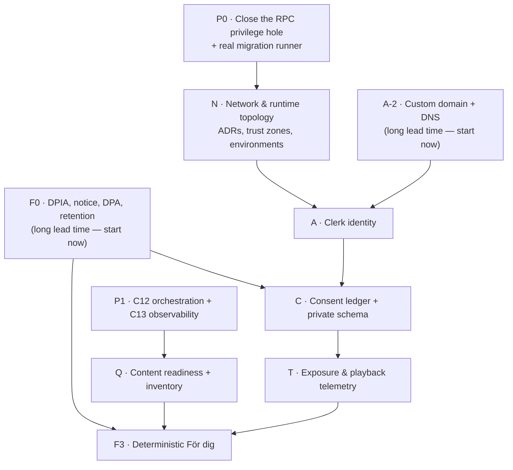
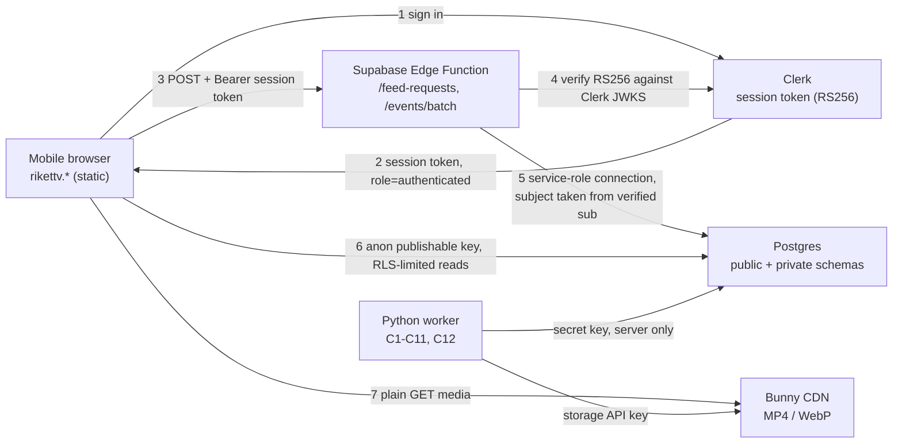

# Recommendation system — prerequisite checklist

**Status:** Working checklist. Not yet reviewed or signed off.

**Last updated:** 2026-08-14 (inactive explicit-interest rule-serving slice)

**Companion to:** `docs/RECOMMENDATION_LAUNCH_PLAN.md` (the architecture), `docs/BUILD_PLAN.md` (the chunks), `AGENTS.md` (the rules).

**Question this answers:** *What has to be true before we can start building the recommender?*

**Engineering preview status (2026-08-14):** migrations 018/019, service-only
consent/feed RPCs, Clerk JWT and Svix verification, deterministic 5/2/2/1 rule
ranking, served-slate recording, and onboarding/feed wiring now exist behind
`VITE_RECOMMENDATIONS_ENABLED=false`. They are not deployed or activated by
this work. Checkboxes below remain open wherever acceptance still requires the
real Supabase project, lifecycle/rights workflows, retention, owner approval,
telemetry or production QA.

---

## 0. How to use this document

Every item has a stable ID (`P0-3`, `A-7`, …). Reference the ID in commits, `PROGRESS.md`
handoffs and `docs/BUILD_PLAN.md` scope entries.

| Marker | Meaning |
|---|---|
| **GATE** | Nothing downstream may ship until this is done. Non-negotiable. |
| **BLOCKER** | Currently blocks work that looks unblocked. Read it before planning a session. |
| *(unmarked)* | Required before launch, but can run in parallel. |

An item is **done** when its stated acceptance check passes *and* a test or a written artifact
proves it. "I clicked it in the dashboard once" is not done — dashboard state drifts and nobody
else can see it. Anything configured by hand must also be captured in a migration, a
`config.toml`, an ADR or the env-var inventory in Appendix A.

Two locked decisions frame the whole list:

1. **Identity is Clerk only**, wired into Supabase through the *native third-party auth
   integration* — not the deprecated JWT template. Supabase Auth is not used, and there are no
   Supabase anonymous users. Logged-out visitors get `Senaste`; `För dig` requires sign-in.
2. **The serving layer is Supabase Edge Functions** (Deno/TypeScript), sitting next to Postgres.
   The Python pipeline keeps producing content and never serves the feed.

Both need an ADR before code (see `O-7`).

---

## 1. Where we actually are today

Verified against the repo on 2026-08-02, not assumed.

| Area | Reality | Consequence |
|---|---|---|
| Pipeline | C0–C11 complete, 138 tests green | Content production is fine. Nothing here blocks the recommender. |
| Orchestration | C12 queue + graph + CLI + **catch-up discovery daemon**; C13 metrics, runbook and drift alert. **render fans out one job per clip** | `P1-1` … `P1-5`, `P1-7` closed. Runs on the local workstation, not InstaPods — freshness is bounded by how often that machine is on. |
| Inventory | 16 published clips, one debate (`HD10540`) | Far too thin for pool-based ranking. See `Q-5`. |
| Migrations | `001` … `005`, all **applied** to the live project and recorded in the ledger | `python scripts/apply_migrations.py` is the runner. |
| Migration runner | ~~hardcoded path~~ → `src/publish/migrations.py` does ordered discovery plus a `schema_migrations` ledger with checksums | `P0-3` **closed**. Applying twice is a no-op; an edited-after-apply migration fails loudly. |
| RPC privilege | ~~`publish_clip_batch` executable by `PUBLIC`~~ → revoked by migration 002, applied live | `P0-1`, `P0-2` **closed**. |
| Default table grants | ~~`anon` held `INSERT` on `public.clips`, `jobs`, `engagement_events`~~ → revoked by migration `004`, including the default for future tables | `P0-7` **closed**. `POST /rest/v1/clips` now answers `permission denied for table clips`. New tables in `public` are unreachable until explicitly granted. |
| Auth | **Clerk → Supabase verified end to end 2026-08-02.** A signed-in call returns `sub=user_3HN2v8f…`, `role=authenticated`, `pg_role=authenticated`; the same call as `anon` is denied | `A-3`, `A-4` **closed**. `auth.jwt()->>'sub'` resolves the Clerk subject and `auth.uid()` is `null`, confirming the `A-7` design. Token lifetime is **60 s** — see `A-8`. |
| Frontend data layer | `web/src/supabase.ts` uses raw `fetch` with the publishable key. No `@supabase/supabase-js` | Deliberate: `supabaseRest(path, {accessToken})` is a 20-line equivalent. Revisit at `A-6` only if the SDK earns its bundle cost. |
| Frontend state | `liked`, `saved`, `following`, `followedParties`, `consent` are all `useState` in `App.tsx` | Nothing survives reload. Nothing reaches the server. |
| Consent UI | Defaults are now all `false`, still in-memory | Half of `C-5`. Enforces nothing; the server does not know about it. |
| Feed modes | `För dig` / `Senaste` toggle React state over one identical array | Cosmetic. |
| Engagement counts | ~~`mapClip()` fabricates `likes`/`comments`~~ → removed, along with the invented profile counts | `FE-2` **closed**. |
| Sample-clip fallback | ~~silent substitution~~ → `loadPublishedClips()` returns a typed `ClipFeed` with its `source`; demo data is opt-in behind `VITE_ALLOW_SAMPLE_CLIPS` | `FE-1` **closed**. |
| Telemetry | `engagement_events` table exists; nothing writes to it | No denominator, no exposure log. |
| Topics | `clips.topic` is normally `null` | V1 ranks on party/politician only. |
| CI | `.github/workflows/ci.yml` runs pipeline acceptance, web typecheck/build and repository hygiene | `O-1` **closed**. First run needs watching — the pinned torch stack is a cold-cache install. |
| Hosting | `rikettv.nbg1-3.instapods.app`, static host, deploys from `origin/main` | No DNS control on that hostname → **Clerk production instance is blocked**. See `A-2`. |

---

## 2. Critical path



Three things have long lead times and should start **today**, in parallel with everything else:
the DPIA (`F0-1`), the custom domain (`A-2`), and content volume (`Q-1`). None of them go faster
by being started later.

---

## 3. Block P0 — Database security and migration hardening · **GATE**

Do this first. It is small, it is the only item that is a live risk right now, and everything
else adds tables to a database whose privilege model is unverified.

> **Status 2026-08-02 — CLOSED.** Migrations `003` and `004` are applied to project
> `nlooigmwuqqhhnontlgp` and `python -m pytest tests/live/test_db_privileges.py -m live`
> is green (52 passed). Re-verified from outside with nothing but the publishable key:
>
> | Probe | Before | After |
> |---|---|---|
> | `POST /rest/v1/clips` | `42501 new row violates row-level security policy` | `42501 permission denied for table clips` |
> | `GET /rest/v1/clip_features` | `200 []` | `42501 permission denied` |
> | `POST /rest/v1/rpc/auth_probe` | `404 PGRST202` | `42501 permission denied for function auth_probe` |
> | `GET /rest/v1/clips` | 16 rows | 16 rows |
>
> The first row is the whole point. `violates row-level security policy` means the grant
> was there and the statement reached the policy check; `permission denied` means it is
> gone. The last row confirms no regression to the public feed.
>
> Only `P0-8` (reconcile live rows against known runs) and `P0-9` (key rotation decision)
> remain open in this block.

- [x] **P0-1 · DONE 2026-08-02 — Verify the deployed privilege on `publish_clip_batch`.**
      Do not assume it is safe and do not assume it is broken. Run the check in Appendix B
      against project `nlooigmwuqqhhnontlgp`, then attempt an actual anon RPC call from outside
      the network with a harmless payload.
      *Accept:* a written result recorded in `PROGRESS.md` under Observations, showing exactly
      which roles hold `EXECUTE`.

- [x] **P0-2 · DONE 2026-08-02 — Add `migrations/002_security_hardening.up.sql` / `.down.sql`.**
      Must contain at least:
      ```sql
      revoke all on function public.publish_clip_batch(jsonb)
        from public, anon, authenticated;
      grant execute on function public.publish_clip_batch(jsonb)
        to service_role;
      ```
      *Accept:* an integration test against a real Postgres proves `anon` and `authenticated`
      get `permission denied for function publish_clip_batch`.

- [x] **P0-3 · DONE 2026-08-02 — Replace the hardcoded migration path.**
      `src/stages/publish.py:32` pins `001_publish_schema.up.sql`. `002` would never run.
      Implement ordered discovery (`sorted(glob("migrations/*.up.sql"))`) *plus* a
      `public.schema_migrations` ledger recording filename, checksum and applied-at, so a run
      is idempotent and an edited-after-apply migration is detected.
      *Accept:* applying twice is a no-op; a mutated checksum fails loudly; a fresh database
      converges to the same schema as the live project.

- [x] **P0-4 · DONE 2026-08-02 — Add a privilege guard test.**
      A test that enumerates every `SECURITY DEFINER` function in `public` and fails if any is
      executable by `PUBLIC`, `anon` or `authenticated`. This must fail for *future* functions
      too, not just this one — that is the point of it.

- [x] **P0-5 · DONE 2026-08-02 — Harden `search_path` on definer functions.**
      `publish_clip_batch` sets `search_path = public`. Prefer `set search_path = ''` with fully
      qualified identifiers, or at minimum `pg_catalog, public`, so a same-named object in a
      caller-controlled schema cannot be resolved first.

- [x] **P0-6 · DONE 2026-08-02 — Narrow `sources_public_read`.**
      The policy currently allows `status in ('published','processed','discovered')`. `discovered`
      leaks debates we have found but not published. Drop it unless there is a stated product
      reason to expose the discovery queue.

- [x] **P0-7 · DONE 2026-08-02 — Prove the protected tables are actually protected.**
      `clip_features`, `engagement_events`, `jobs`, `pipeline_runs` have RLS enabled and no
      policies, which should deny by default — but they also need no `grant` to `anon` or
      `authenticated`. Write the full RLS matrix test: for each table × each role ×
      {select, insert, update, delete}, assert the expected outcome.
      *Accept:* the matrix is a committed test, not a one-off query.

- [ ] **P0-8 — Reconcile live data against known pipeline runs.**
      Confirm every `clips` row and Bunny object corresponds to a run we can account for. If the
      RPC was publicly callable, this is the check for whether anyone used it.

- [ ] **P0-9 — Key inventory and rotation decision.**
      Confirm `RIKET_SUPABASE_SECRET_KEY`, `RIKET_SUPABASE_ACCESS_TOKEN` and
      `RIKET_BUNNY_API_KEY` appear in no `VITE_*` variable, no committed file and no build log.
      Decide whether to rotate based on the `P0-1` result. Record the inventory in Appendix A.

- [x] **P0-10 · DONE 2026-08-02 — Write the chunk into `docs/BUILD_PLAN.md` with explicit file scope.**
      `AGENTS.md` rule 2 requires it, and P0 touches migrations, publish-stage code and tests —
      outside any existing chunk's declared scope.

---

## 4. Block P1 — Continuous supply (C12 + C13) · **GATE for `För dig`, not for `Senaste`**

A recommender over a static 16-clip catalogue is a shuffle. The pools in the launch plan
(`fresh_interest`, `fresh_general`, `back_catalog_interest`, …) are meaningless without a stream
of new content.

- [x] **P1-1 · DONE 2026-08-03 — C12 orchestration**, per `docs/BUILD_PLAN.md`: job graph, fan-out, idempotency
      keys, backoff, dead-letter, worker pools, CLI, 30-minute cron discovery.
- [x] **P1-2 · DONE 2026-08-03 — Crash-recovery acceptance**: kill mid-render, restart, converge with no duplicate
      work and no missing output. This is C12's stated acceptance criterion; do not soften it.
- [x] **P1-3 · DONE 2026-08-03 — C13 observability**: per-stage timing, `pipeline status` queries, failure-rate
      alerting, Riksdagen schema-drift alerting via the scheduled C1 live test.
- [x] **P1-4 · DONE 2026-08-03 — Party/speaker distribution query** (ARCHITECTURE §R5): clips per party over
      trailing 7 days. Needed later as a fairness guardrail; build it now while it is cheap.
- [x] **P1-5 · DONE 2026-08-03 — Freshness SLO**: measure and publish debate-available → published-eligible lag.
      Until this number exists, "fresh" is not a thing the ranker can reason about.
- [ ] **P1-6 — Backfill script with rate limiting**, and a rule that backfilled old debates carry
      their real `debate_date` and never enter a `fresh_*` pool on the strength of a recent
      `published_at`.
- [x] **P1-7 · DONE 2026-08-03 — `docs/RUNBOOK.md`** covering every failure mode in `ARCHITECTURE.md`.
- [ ] **P1-8 — Unattended full debate day** processes without human intervention.

---

## 5. Block N — Network and runtime topology

How the pieces reach each other, and what authenticates each hop. This block is mostly
*decisions and configuration*, but skipping it is how you end up with a secret key in a browser
bundle.

### 5.1 The request path



- [ ] **N-1 · GATE — ADR 005: serving boundary and runtime.** Record the Edge Functions decision,
      what the React app is allowed to compute (nothing authoritative), and why the Python
      pipeline does not serve.
- [ ] **N-2 · GATE — Trust-zone table.** For every hop above: which credential, which role, what
      it can reach if stolen. Publishable key → RLS-limited public reads only. Secret key →
      server only. Clerk session token → identifies a subject, grants nothing by itself.
- [ ] **N-3 — CORS and allowed origins.** Edge Functions must allow exactly the app origins
      (prod, staging, `localhost:5199`), handle `OPTIONS` preflight, and echo no wildcard on
      credentialed routes. Clerk's allowed origins list needs the same treatment.
- [ ] **N-4 — SPA routing on the static host.** The InstaPods static host serves the pod root.
      Any Clerk redirect route (`/sign-in`, `/sso-callback`) 404s without an
      `index.html` fallback. Either configure the rewrite or use modal/hash-based auth flows —
      decide before wiring Clerk, not after.
- [ ] **N-5 — Bunny CDN posture.** Decide on token authentication / hotlink protection for MP4
      URLs, and *find out the CDN access-log retention setting*. An IP plus a clip URL is a
      record of someone's political viewing; it belongs in the F0 data-flow inventory
      (`F0-4`) whether or not the app has an account for them.
- [ ] **N-6 — Region and latency budget.** Supabase project region vs Bunny DE/Falkenstein vs
      the Edge Function region. The release gate is p95 < 400 ms for a 20-item page; measure the
      DB round trip before designing the query, not after.
- [ ] **N-7 — Idempotency and retry semantics across the wire.** `POST /feed-requests` keyed by
      `client_request_id`; `POST /events/batch` keyed by per-event client UUID. A retry must
      return the recorded slate, never create a second exposure. Serving is `POST` precisely so a
      prefetcher cannot manufacture impressions.
- [ ] **N-8 — Rate limiting and abuse.** Per-subject and per-IP limits on both endpoints,
      payload size caps, and server-side bounds validation on every numeric field.
- [ ] **N-9 — Request correlation.** One request ID generated at the client, carried through the
      Edge Function into `structlog`-style JSON logs and into `feed_requests`, so a user report
      can be traced across all three systems.
- [ ] **N-10 — Environments.** Three of everything, or an explicit written decision not to:
      Supabase project (prod / staging), Clerk instance (production / development), Bunny zone,
      app origin. Today there is exactly one Supabase project and it is production.
- [ ] **N-11 — Failure behaviour per hop.** Clerk unreachable → `Senaste` still works.
      Edge Function 5xx or timeout → chronological fallback, no blank feed. Postgres failover →
      cached slate or graceful empty state with a retry. Bunny 404 on a clip → skip and log,
      never a broken player.
- [ ] **N-12 — Kill switch reachable without a redeploy.** A config row read per request that
      forces `Senaste` ordering for everyone. Test it.

---

## 6. Block A — Clerk identity · **GATE**

All greenfield. The mechanism below is the current native integration; the older
"Supabase JWT template" path in Clerk has been deprecated since 1 April 2025 and must not be
used — it requires sharing the Supabase JWT secret with a third party.

### 6.1 Provisioning

- [ ] **A-1 — Create the Clerk application**, with separate development and production
      instances. Decide the sign-in methods (email OTP? OAuth? passkeys?) — this is a product
      decision with privacy consequences, so it belongs in the F0 notice as well.
- [ ] **A-2 · BLOCKER — Custom domain and DNS.** A Clerk *production* instance needs CNAME records
      on a domain you control, and `rikettv.nbg1-3.instapods.app` is not one. Register the real
      domain now — the chain is registration → DNS → TLS → InstaPods custom-domain config →
      Clerk DNS verification, and DNS propagation alone can take up to 48 hours. (Clerk's
      `clerk deploy` CLI walks the DNS/OAuth steps; and if a Frontend API CNAME is genuinely
      impossible, Clerk supports a proxy instead — but that is a fallback, not the plan.) The
      development instance works on any origin, so `A-3` … `A-14` can be built against it in
      parallel; only production launch is blocked. Start this today.
- [x] **A-3 · DONE 2026-08-02 (verified live, see PROGRESS.md) — Activate the Supabase integration in the Clerk dashboard** so session tokens carry
      `"role": "authenticated"`. Supabase's PostgREST rejects tokens without it. If configuring
      by hand instead, add the `role` claim via custom session token customization.
- [x] **A-4 · DONE 2026-08-02 — Register Clerk as a third-party auth provider in Supabase** (Authentication →
      Sign In / Providers → Clerk), pasting the Clerk domain. Mirror it for local development in
      `supabase/config.toml`:
      ```toml
      [auth.third_party.clerk]
      enabled = true
      domain = "<your-instance>.clerk.accounts.dev"
      ```
      *Accept:* the config is committed, so a fresh local environment reproduces it.
- [x] **A-5 · DONE 2026-08-02 — Explicitly reject the deprecated JWT-template path** in ADR 005, so a future
      session does not "fix" the integration by reintroducing it.

### 6.2 Client wiring

- [ ] **A-6 — Add `@clerk/clerk-react` and `@supabase/supabase-js`**, pinned to exact versions,
      each with a one-line justification in `docs/DEPENDENCIES.md` (`AGENTS.md` rule 5).
      Rewrite `web/src/supabase.ts` from raw `fetch` to a client created with the Clerk token
      callback:
      ```ts
      createClient(url, publishableKey, {
        accessToken: async () => session?.getToken() ?? null,
      })
      ```
      *Accept:* `loadPublishedClips()` still works signed-out (publishable key only), and
      signed-in requests carry the Clerk token.
- [ ] **A-7 · GATE — Subject key type is `text`, not `uuid`.** Clerk user IDs are strings like
      `user_2abc…`. Every private table keys on `clerk_user_id text`, and RLS compares
      `(select auth.jwt()->>'sub')`. There is no `auth.users` table to reference and no
      `auth.uid()` UUID. Getting this wrong means rewriting the whole private schema later.
- [ ] **A-8 · MEASURED 2026-08-02: 60 s — Token lifetime and refresh.** Clerk session tokens
      live exactly 60 seconds (`exp - iat`, verified live). Decide the
      behaviour when a token expires mid-scroll: silent refresh then retry once, then fall back
      to `Senaste` rather than showing an error. Never lose queued telemetry on a 401.
- [ ] **A-9 — Signed-out path must stay fully functional.** `Senaste` uses the publishable key
      and RLS-limited public reads, exactly as today. No sign-in wall. This is decision 3 in the
      launch plan and a GDPR "freely given" argument, not just a nicety.
- [x] **A-10 · PARTIAL 2026-08-02 — Swedish localization and mobile-only presentation** for all Clerk UI. The app
      gates at ≥700px; the auth screens must not break that contract.

### 6.3 Server-side verification

- [ ] **A-11 · GATE — Edge Function JWT verification.** The platform-level `verify_jwt` check
      does not validate Clerk's RS256 tokens against the Clerk JWKS, and it is being deprecated
      in favour of in-function verification. Deploy with `verify_jwt = false` /
      `--no-verify-jwt` and verify inside the handler: fetch and **cache** the Clerk JWKS,
      check signature, `iss`, `exp`, `nbf`, and `azp`/authorized party against the allowed
      origins.
      *Accept:* a test with a token signed by the wrong key, an expired token, an unknown
      issuer and a wrong `azp` each returns 401 and writes nothing.
- [ ] **A-12 · GATE — Never trust a client-supplied subject.** Service-role code bypasses RLS, so
      the Edge Function must derive the subject from the verified `sub` claim only. A
      `user_id` in a request body is ignored, always.
      *Accept:* a test that posts someone else's user ID and observes it has no effect.
- [ ] **A-13 — Staff/canary claim.** Add a `staff` (or role) claim through Clerk public metadata
      so the shadow/canary rollout in F3 can target staff accounts without a hardcoded ID list.

### 6.4 Lifecycle and deletion

- [ ] **A-14 · GATE — Clerk webhooks → cascade delete.** Handle `user.deleted` (and
      `user.updated` if profile data is mirrored). Verify the Svix signature on every webhook;
      an unauthenticated delete endpoint is a denial-of-service on your own users' data.
      Deleting in Clerk must remove consent records, preferences, inferred state, raw events and
      cached slates per the `F0-6` retention design.
      *Accept:* end-to-end test — create user, generate events, delete in Clerk, assert every
      private row is gone or irreversibly anonymized.
- [ ] **A-15 — Account deletion initiated in-app** must reach the same code path.
- [ ] **A-16 — Bot and abuse protection** on sign-up (Clerk's built-in protections), plus the
      rate limits from `N-8`. Pseudonymous accounts that cost nothing to create are a cheap way
      to pollute the training set.
- [ ] **A-17 — Cost model.** Clerk MAU pricing plus Supabase third-party MAU charges. Know the
      number before launch; personalization that costs more per user than it returns is a
      product decision, not a surprise.
- [ ] **A-18 — Age and minors handling.** Decide what age signal Clerk collects, if any, and how
      it enforces the "no political profile under 18" policy. Collect the minimum the chosen
      control requires. This is an F0 decision (`F0-7`) with an A-block implementation.

---

## 7. Block C — Consent ledger and private schema · **GATE**

Nothing in this block may ship before `F0` has produced its decisions, because the table shapes
encode the legal answers.

**Partial engineering evidence, 2026-08-14:** C-1–C-8 have an inactive
implementation in migration 018 and the `consent` Edge Function. It defaults
off, keeps the ledger append-only, derives the subject from verified Clerk JWTs,
and deletes explicit preferences on withdrawal. C-10–C-12 and the required
real-database RLS matrix are still open, so this is not F1 completion.

- [ ] **C-1 · GATE — Create the `private` schema** and revoke `usage` from `anon` and
      `authenticated`. It must not be exposed through PostgREST at all. Public political content
      stays in `public`; viewer behaviour and political-interest profiles never do.
- [ ] **C-2 · GATE — `private.consent_records`**: subject (`text`, Clerk `sub`), purpose,
      granted/withdrawn, Article 6 basis, Article 9 condition, notice version, UI source,
      timestamps. Append-only — a withdrawal is a new row, never an update over the grant.
- [ ] **C-3 — Consent version registry.** Every notice text version is stored and referenced by
      ID, so a 2027 audit can reconstruct exactly what a 2026 user agreed to.
- [ ] **C-4 · GATE — Separate purposes.** Personalization, analytics, email, model-training reuse
      are four independent consents. One "improve my experience" switch is not specific enough.
- [ ] **C-5 · GATE — Default off, and delete the mockup.** Replace
      `useState({ personal: true, analytics: false, email: true })` in `App.tsx` with
      server-backed state that starts denied. Until the user actively grants, party choices stay
      local and no watch history or inferred state is transmitted or persisted.
- [ ] **C-6 · GATE — Server-side enforcement.** A single helper in the Edge Function that both
      endpoints call. Consent absent → `for_you` is refused and falls back; personalization
      events are rejected or stripped. Enforcement lives on the server; the UI toggle is a
      display of state, not the mechanism.
- [ ] **C-7 · GATE — Withdrawal takes effect on the next request.** Cancel in-flight personalized
      calls, purge the client outbox for that purpose, switch to non-profiled. Withdrawal must
      be as easy as granting.
- [ ] **C-8 — `private.viewer_preferences`**: subject, entity type/id, signed weight, source
      (`explicit` / `follow` / `inferred`), created/updated/decayed timestamps. Explicit choices
      stay separable from inferred ones so the UI can show and edit each independently.
- [ ] **C-9 — Follows and likes persist server-side**, replacing the `following` / `liked` /
      `saved` React maps. Keyed on `politicians.id`, never a display-name slug (`Q-2`).
- [ ] **C-10 · GATE — Subject rights are real workflows**: export, access, preference edit,
      recommendation reset, deletion. Export covers observed events and inferred affinities.
      Placeholder buttons do not count.
- [ ] **C-11 — RLS matrix for every private table**, in the same test harness as `P0-7`:
      anon, authenticated-as-A, authenticated-as-B, service_role.
- [ ] **C-12 — Retention jobs exist and run** for the periods `F0-6` settles on. A retention
      policy nobody implemented is worse than no policy, because it is written down.
- [ ] **C-13 — No sensitive values in URLs, ordinary logs, client analytics or public tables.**
      Add a log-scrubbing check. Party affinity in a query string is a leak into every proxy and
      access log on the path.

---

## 8. Block T — Exposure and playback telemetry · **GATE**

Without this there is no denominator, so there is nothing to evaluate a ranker against, ever.
This block is the reason `Senaste` ships before `För dig` — it is instrumented first on the easy
feed.

**Partial engineering evidence, 2026-08-14:** migration 019 records an
idempotent, transactionally served denominator for consented `for_you` slates
(part of T-1/T-2/T-4). It deliberately creates no playback-event table, event
token, outbox or inferred aggregate, and records nothing for `latest`. This is
not F2 telemetry completion and does not create ML training data.

- [ ] **T-1 · GATE — `private.feed_requests`**: request id, nullable subject/session, mode,
      algorithm version, model version, experiment snapshot, consent state, request time.
- [ ] **T-2 · GATE — `private.feed_items`**: request, clip, position, pool, reason, score
      components, exploration probability, opaque signed event token.
- [ ] **T-3 · GATE — `private.playback_events`**: client event UUID (unique), feed item, event
      type, client time, server time, watch delta, progress, metadata.
- [ ] **T-4 · GATE — Log the slate transactionally before responding.** For consented requests
      the denominator must exist even if the client never emits a single impression.
- [ ] **T-5 · GATE — No-consent requests create no persistent viewer history.** A `latest`
      request is not attached to a stable subject.
      *Accept:* a test that drives a full anonymous session and asserts zero private rows.
- [ ] **T-6 — Signed event tokens.** The client may only report against items the server issued.
      Sign them; verify them; never accept a raw clip ID as proof of exposure.
- [ ] **T-7 — Idempotent ingestion.** Replaying a batch converges to one row per event UUID.
      *Accept:* replay test, plus an out-of-order and an offline-then-flush test.
- [x] **T-8 · PARTIAL 2026-08-02 — Impression definition, written down and implemented once.** Roughly 72% visible for
      at least one second while the document is visible. Both client and analytics use the same
      definition; a metric with two definitions is a metric with none.
- [ ] **T-9 — Watch time is wall-clock active playback**, accumulated while playing *and*
      visible — never a delta of `video.currentTime`, which seeks and loops corrupt.
- [ ] **T-10 — Funnel reconciliation.** served → impression → play → qualified → completed must
      reconcile within an agreed tolerance, checked by a committed data-quality query.
- [ ] **T-11 — Versioned aggregation jobs** producing `private.viewer_interest_state` and item
      aggregates, with a feature version stamped on every row. Behavioural affinity stays out of
      the score until these pass reconciliation.
- [ ] **T-12 — Transport for page-exit events.** `fetch(..., { keepalive: true })` with the
      Authorization header. `sendBeacon` cannot attach a bearer token and is only safe with a
      separately designed signed token — do not reach for it by reflex.
- [ ] **T-13 — Retention jobs** for raw events (proposed 90 days) and served items (proposed
      13 months), pending `F0-6`.

---

## 9. Block FE — Frontend prerequisites

`web/src/App.tsx` is 1042 lines of demo. Several current behaviours would actively corrupt the
training data, so they must change *before* telemetry is switched on, not after.

**Partial engineering evidence, 2026-08-14:** behind the inactive flag, feed
mode cancels stale requests, renders the server order, connects the consented
onboarding party/follow choices, shows a reason label, and falls back honestly to
`Senaste`. Cursor pagination, not-interested/reset, the event state machine and
the full mobile QA matrix remain open.

- [x] **FE-1 · DONE 2026-08-02 — Remove `SAMPLE_CLIPS` fallback from any telemetry-bearing build.**
      `loadPublishedClips()` returns samples on missing env vars, on empty results and never
      distinguishes them. Sample clips generating impression events would poison the dataset
      silently.
- [x] **FE-2 · DONE 2026-08-02 — Remove the fabricated engagement numbers.** `mapClip()` invents
      `likes: 1200 + index * 143` and `comments: 64 + index * 17`. On a political feed, invented
      popularity figures shown as fact are a credibility problem well before they are a data
      problem. Show real counts or show none.
- [x] **FE-3 · DONE 2026-08-02 — Replace `loop` on the `<video>` element** (`App.tsx:358`) or instrument
      loop boundaries explicitly. Right now completion and replay are indistinguishable, so two
      of the strongest positive signals are unusable.
- [x] **FE-4 · DONE 2026-08-02 — Replace immediate `isIntersecting` activation** (`App.tsx:238`) with an
      intersection-ratio winner plus a dwell timer. A fast scroll past ten clips currently marks
      ten clips active.
- [x] **FE-5 · DONE 2026-08-02 — Model `autoplay_blocked` separately from a user pause.** Browser policy blocking
      unmuted autoplay must never be recorded as a negative preference. This is a known live
      behaviour, already noted in `PROGRESS.md`.
- [ ] **FE-6 — Explicit playback state machine**: idle / blocked / playing / paused / seeking /
      buffering / ended, with `visibilitychange` handling. Every telemetry event derives from a
      transition, not from an ad-hoc handler.
- [ ] **FE-7 — Feed mode calls the endpoint.** `setFeedMode` must trigger a new request, cancel
      the stale one, and never let a late response overwrite a newer mode.
- [ ] **FE-8 — Render the served order unchanged.** No local reranking, no client-side filtering
      of the slate. Prefetching media is fine.
- [ ] **FE-9 — Cursor pagination appends without resetting.** The feed must not jump back to item
      one when a page arrives.
- [ ] **FE-10 — Client outbox** with retry, dedupe by event UUID, and a flush before
      virtualization unmount.
- [ ] **FE-11 — New UI surfaces**: onboarding, consent screens, "Why this clip?", "not
      interested", edit interests, reset recommendations, turn off personalization. These are
      launch requirements from the privacy block, not phase-two polish.
- [x] **FE-12 · DONE 2026-08-02 — Honest error and empty states.** No silent substitution of fake data on failure.
- [ ] **FE-13 — Typed feed DTO** in `web/src/types.ts` matching the response envelope, including
      `feed_request_id`, `feed_item_id`, `position`, `reason`, `event_token`, `politician_id`,
      `content_at`.
- [ ] **FE-14 — Mobile QA matrix** at 393×852, 360×640, 320×568, signed-in and signed-out,
      consent granted and withdrawn — matching the existing QA practice in `PROGRESS.md`.

---

## 10. Block Q — Content and data readiness

- [ ] **Q-1 · BLOCKER — Inventory volume.** The owner reports more than 3,000 clips as of
      2026-08-14, so the original 16-clip volume blocker is likely obsolete, but party/speaker/date
      distribution and the minimum viable catalogue still need a committed measurement. 16 clips from one debate cannot fill five retrieval
      pools or a 5/2/2/1 mix. Define the minimum viable catalogue (parties covered, speakers,
      debate dates, clips per party) before `För dig` is anything but a shuffle. This is
      gated on `P1`, and it is the single slowest prerequisite.
- [x] **Q-2 · DONE 2026-08-04 — Expose `politician_id` in the feed DTO.** `speeches.politician_id`
      existed in the schema since migration 001 and the frontend had never read it; person
      identity came from a slugified display name.
      **It had already broken, not "would break".** `cleanName()` stripped only four hardcoded
      title prefixes — the set present in the 16-clip HD10540 batch it was written against — so
      165 real politicians rendered as **171 identities**, with the five most-clipped ministers
      split in two each: **380 clips, 21.6% of the catalogue.**
      `ClipItem` now carries `politicianId` (`public.politicians.id`) and follows key on it.
      No migration was needed: `intressent_id` is the `on conflict` target so the uuid is stable
      across a title change, and `anon` already had `select`.
      *Accept:* verified live — one follow on an Anna Tenje clip flips all 9 of her clips and
      none of the other 51; every identity in a 60-clip page is a uuid; an unlinked speaker
      (10 clips, 0.57%) gets inert follow/profile controls rather than a name fallback.
      See `PROGRESS.md`, "Q2 — Stable politician identity in the feed DTO".
- [ ] **Q-3 — Calibrated quality prior.** Do not compare raw C7 `final_score` across speeches —
      C7 z-scores within a speech by design. Start with the publish gate, `rank_in_speech`,
      absolute framing/comprehensibility features and a percentile calibrated per
      archetype/debate type.
- [ ] **Q-4 — `content_at` and `temporal_class`.** Derive age from `sources.debate_date`;
      `clips.published_at` is availability only. Until temporal classification exists, cap the
      back catalogue at two of the first ten slots and always show the date.
- [ ] **Q-5 — Recommendation metadata lives outside `src/contracts.py`.** Adding fields to the
      frozen pipeline contracts requires an ADR and breaks chunk boundaries (`AGENTS.md` rule 1).
      Use `public.clip_reco_features` or a server-only equivalent instead.
- [ ] **Q-6 — Topics stay neutral until F5.** `clips.topic` is normally `null`. V1 explicit
      onboarding uses parties and politicians only; a topic taxonomy for Swedish political
      content needs review before it ranks anything.
- [ ] **Q-7 — Keep the two exploration loops distinct.** `clip_features.was_explore` is
      publishing exploration (C11 always writes `false`). Serving exploration is a different
      thing, logged on the served item with its selection probability. Do not let one boolean
      pretend to be both.
- [ ] **Q-8 — Every clip renders its debate date and source link.** Guardrail target for "old
      content without a visible date" is exactly zero.

---

## 11. Block F0 — Privacy, legal and product contract

> ### Who wrote this block, and what is actually binding
>
> **Revised 2026-08-02 at the project owner's direction.**
>
> This document is the project's own work product — an earlier agent session wrote it,
> including the original "engage Swedish privacy counsel" gate. That was a
> *recommendation*, not an external requirement, and it had no business blocking
> engineering. It is demoted below.
>
> Two things are worth keeping straight, because only one of them is negotiable:
>
> **Binding regardless of anyone's opinion.** Inferring a person's political interests
> from what they watch produces special-category data under GDPR Article 9. That is
> the regulation. It applies to this project whether or not a lawyer ever reads it,
> and it is why the private schema, the consent ledger and the retention jobs exist
> at all. Removing them does not remove the obligation; it just removes the evidence
> that it was met.
>
> **Advice, and the owner's call.** Whether to pay a professional to review the
> analysis. The owner has decided not to engage counsel. That is a normal decision
> for a project this size, it is recorded in `F0-2`, and nothing else in this block
> waits on it.
>
> **What that changes in practice:** every remaining item here is work that can be
> done in-repo — a data-flow inventory is engineering, a DPIA is a structured
> document, a privacy notice is writing. They are drafted in `docs/privacy/` and
> approved by the owner. What no longer exists is an item that can only be closed by
> hiring someone.
>
> **What still gates what:** these documents gate *collecting real viewer data from
> real users* — Block C and Block T. They do not gate C12, C13, the F1 schema, or
> anything that touches only public parliamentary video. The build order already puts
> the data collection late.

Party preferences and inferred political interests are special-category data under
GDPR Article 9, which changes what is legal, not just what is polite.

- [ ] **F0-1 · GATE — DPIA**, including an explicit Article 22 conclusion. The design meets IMY
      criterion 1 (evaluation/profiling of internet users) and criterion 4 (special-category
      data); two criteria trigger the requirement. Complete it *before* collection begins.
      Drafted in-repo against IMY's published criteria; approved by the project owner.
      **Draft now exists:** `docs/privacy/DPIA.md`; owner approval and a pre-F3 re-run remain.
- [x] **F0-2 · DECIDED 2026-08-02 — No external counsel review.** The project owner has
      decided not to engage Swedish privacy counsel, and accepts the residual risk of
      proceeding on an in-house Article 6 / Article 9(2)(a) analysis.
      *This is a recorded risk acceptance, not a completed review.* The consequences,
      stated plainly so the decision is an informed one: nobody with professional
      liability has checked the lawful-basis analysis; if IMY ever asks, the answer is
      "we assessed it ourselves"; and the questions of whether prior consultation or a
      DPO is required are unanswered rather than answered "no".
      Revisit if the service takes payment, carries advertising, grows past a few
      thousand users, or processes data about minors.
- [ ] **F0-3 · GATE — Article 13 privacy notice**, in plain Swedish, stating explicitly that
      viewing activity will be used to infer political interests. "Personalisera mitt flöde" on
      its own is not specific enough to be valid consent.
      **Current-processing notice is live:** `web/src/legal.ts`. It states that this release does
      not send viewing history to a Pleni server; this item remains open until the notice is
      revised before real behavioural profiling starts.
- [ ] **F0-4 · GATE — Data-flow inventory**, covering Clerk (identity, likely a US processor —
      transfer mechanism required), Supabase (storage and compute), Bunny (media **and access
      logs**), and any analytics. Every field gets a purpose and a retention rule.
      **Draft:** `docs/privacy/DATA_FLOW_INVENTORY.md`; provider-account log settings remain.
- [ ] **F0-5 — Processor agreements and subprocessor review** for Clerk, Supabase and Bunny,
      plus international-transfer assessment.
- [ ] **F0-6 · GATE — Retention decisions.** Approve or replace the provisional periods: raw
      events 90 days, served items 13 months, derived interest state rolling 180 days, consent
      evidence for as long as the account exists plus 12 months. Approved by the project
      owner, not by counsel (`F0-2`). Address deletion from backups and from learned-model
      lineage.
- [x] **F0-7 · DECIDED 2026-08-09 — Minors policy.** Public video remains available to everyone.
      Accounts state that under-13 use needs guardian permission. V1 collects no birth date,
      identity document or age-attestation field and uses no universal age gate; the owner chose
      this as the proportionate approach for general-audience parliamentary content. Reassess
      before adding materially riskier interactions. See `docs/privacy/OPERATING_POLICY.md`.
- [x] **F0-8 · CURRENT RELEASE 2026-08-09 — ePrivacy / cookie assessment.** Clerk auth storage is
      necessary when account functionality is requested; account-scoped onboarding/library
      storage is written for a feature the signed-in viewer requests; optional personalisation
      defaults off. There is no analytics or advertising storage. Reopen for every new purpose.
- [ ] **F0-9 — DSA classification.** If Article 27 applies, the main recommender parameters and
      their relative importance must be explained and the feed choice directly accessible. Build
      the transparency controls regardless — they are good product.
      **V1 operating position:** treat stored comments conservatively as hosting for notice/action
      even while the formal ancillary-feature/online-platform classification remains open.
- [x] **F0-10 · DECIDED 2026-08-09 — Advertising firewall.** No recommendation political-interest data reaches any ad
      system, and no paid or promoted political placement, without a separate reviewed project.
      DSA Article 26(3) and Regulation (EU) 2024/900 Article 18 prohibit the profiling-based
      case; explicit consent is not a workaround.
- [ ] **F0-11 — Security controls**: encryption, least-privilege staff and service access, access
      auditing, incident response. RLS alone is not sufficient protection for this category of
      data.
- [ ] **F0-12 — Deletion and export runbook**, tested end to end, including processor copies.
- [ ] **F0-13 — Party-balance policy decision.** Equal exposure, proportional exposure,
      user-controlled, or measurement only? Until it is decided, use transparent soft repetition
      caps at the serving layer and do not claim political neutrality.
- [x] **F0-14 · V1 DECIDED 2026-08-09 — Human review and takedown path.** In-context comment
      reports plus `kontakt@pleni.se` cover comments, clips, rights, corrections and objections;
      the operator can hide/restore/delete through the existing moderation RPC. Response SLO and
      notification automation remain operational hardening. See `docs/privacy/OPERATING_POLICY.md`.

---

## 12. Block O — Engineering and operational readiness

- [x] **O-1 · DONE 2026-08-02 — CI does not exist.** There is no `.github/`. Every gate in this document
      is currently enforced by an agent remembering to run `python tasks.py test lint typecheck`.
      Add a pipeline running unit + integration + database tests on every push.
- [ ] **O-2 — Staging environment** (`N-10`). Right now the only Supabase project is production,
      and the only way to test a migration is to apply it to live data.
- [ ] **O-3 — Database integration tests against a real Postgres.** RLS, grants and
      `SECURITY DEFINER` behaviour cannot be unit-tested with mocks — `AGENTS.md` rule 3 rules
      that out anyway. Add a `db` pytest marker alongside `live` and `slow`.
- [ ] **O-4 — Deno toolchain for Edge Functions**: format, lint, type-check and test wired into
      `tasks.py` so `python tasks.py test lint typecheck` still means "everything is green".
- [ ] **O-5 — Pin Deno and npm dependencies exactly**, each with a line in
      `docs/DEPENDENCIES.md` (`AGENTS.md` rule 5). Unpinned Deno URL imports are a supply-chain
      hole and a reproducibility hole at once.
- [x] **O-6 · DONE 2026-08-02 (F1 scoped; root BUILD_PLAN.md deleted) — Add every approved chunk to `docs/BUILD_PLAN.md` with exact file scope**
      before implementation (`AGENTS.md` rule 2). P0, F0, F1, F2, F3 all touch files outside any
      currently declared chunk.
      *Observation while writing this:* `BUILD_PLAN.md` at the repo root and `docs/BUILD_PLAN.md`
      have **diverged** (different checksums). `AGENTS.md` points at the `docs/` copy. Delete or
      symlink the root one before two agents plan from different documents.
      (`riksdagen-clip-pipeline-architecture.md` and `docs/ARCHITECTURE.md` are still identical.)
- [x] **O-7 · DONE 2026-08-02 — ADRs to write**: 005 serving boundary and runtime; 006 Clerk as sole
      identity provider (and why not Supabase Auth); 007 private schema and consent model;
      008 recommendation metadata outside `src/contracts.py`.
- [ ] **O-8 — Secrets management.** Edge Function secrets, Clerk keys, webhook signing secret,
      Bunny keys. Which are in InstaPods, which in Supabase, which local only (Appendix A).
- [ ] **O-9 — Deployment story for Edge Functions.** The current InstaPods deploy builds a static
      bundle from `origin/main`; Edge Functions deploy through a completely different path.
      Write it down, including how a rollback works.
- [ ] **O-10 — Load test** at representative catalogue size against the p95 < 400 ms gate.
- [ ] **O-11 — Config and version registry** (`private.recommendation_models`, algorithm version,
      slate policy) so every served slate is reconstructable.
- [ ] **O-12 — `PROGRESS.md` handoff per chunk**, per `AGENTS.md` rule 6.

---

## 13. Exit criteria — when may F3 (`För dig`) start?

All of the following, with evidence:

1. `P0-1` … `P0-4` done; a committed test fails if a privileged function becomes publicly
   executable.
2. `P1` complete: content arrives unattended, freshness SLO measured, `Q-1` inventory threshold met.
3. `F0-1`, `F0-3`, `F0-6`, `F0-7` drafted in `docs/privacy/` and signed off by the project
   owner. `F0-2` is a recorded decision not to engage counsel, not a review.
4. Clerk live end to end: `A-2` domain, `A-3`/`A-4` integration, `A-11` verification tests,
   `A-14` deletion cascade.
5. Consent: default-off, versioned, server-enforced, withdrawable, exportable, deletable — all
   under test (`C-2`, `C-5`, `C-6`, `C-7`, `C-10`).
6. Telemetry: `Senaste` served through the real endpoint, funnel reconciling, replay-idempotent,
   anonymous sessions provably leaving no viewer history (`T-4`, `T-5`, `T-7`, `T-10`).
7. Frontend: `FE-1` … `FE-4` shipped, so the first collected data is not already corrupt.
8. Kill switch (`N-12`) tested; staff canary path (`A-13`) working.

If any of these is open, the honest move is to ship a better `Senaste` and keep collecting.

---

## 14. Explicitly *not* prerequisites

Naming these keeps them from creeping into scope:

- Learned ranking, LightGBM, neural retrieval — gated on data volume, not on calendar.
- Embeddings and pgvector similarity — F5, after the deterministic ranker has a baseline.
- Redis, Temporal, a real-time feature store — not justified at this scale.
- Topic taxonomy — F5. V1 uses parties and politicians.
- TalkNet / real active-speaker detection — a pipeline improvement, unrelated to the feed.
- Captions — ADR 004 stands.
- Serving exploration — stays disabled until the endpoint records selection propensity.

---

## 15. Open questions for owners

These block `F0` completion, not technical planning. Recommended defaults from the launch plan
are in brackets.

1. Domain name for production — required for Clerk (`A-2`). *No default; nobody else can pick it.*
2. North-star metric. [Qualified viewing + return rate, not session length.]
3. Party-balance objective. [Transparent repetition caps + reporting.]
4. No-consent experience. [Full `Senaste`, not a degraded wall.]
5. Minors. [Non-profiled under 18 for V1.]
6. Cross-device history and account linking. [Consented pseudonymous identity first.]
7. Back-catalogue share. [≤2 of the first 10 until temporal classification is reviewed.]
8. Advertising. [None using recommendation data, no paid political placement.]
9. Retention periods. [Provisional table in the launch plan, pending DPIA.]
10. Editorial takedown path for stale or misleading clips.

---

## Appendix A — Environment and secret inventory

| Name | Where it lives | Secret? | Notes |
|---|---|---|---|
| `VITE_SUPABASE_URL` | InstaPods build env | No | Already set |
| `VITE_SUPABASE_PUBLISHABLE_KEY` | InstaPods build env | No | RLS-limited public reads only |
| `VITE_CLERK_PUBLISHABLE_KEY` | InstaPods build env | No | To add (`A-6`) |
| `CLERK_SECRET_KEY` | Edge Function secrets | **Yes** | Never in a `VITE_*` variable |
| `CLERK_WEBHOOK_SIGNING_SECRET` | Edge Function secrets | **Yes** | Svix verification (`A-14`) |
| `CLERK_DOMAIN` / JWKS URL | Edge Function config + `supabase/config.toml` | No | (`A-4`, `A-11`) |
| `SUPABASE_SERVICE_ROLE_KEY` | Edge Function secrets | **Yes** | Bypasses RLS — subject must come from the verified JWT |
| `RIKET_SUPABASE_SECRET_KEY` | Local/worker env | **Yes** | Existing, C11 |
| `RIKET_SUPABASE_ACCESS_TOKEN` | Local/worker env | **Yes** | Existing, Management API |
| `RIKET_SUPABASE_PROJECT_REF` | Local/worker env | No | Existing |
| `RIKET_BUNNY_API_KEY` | Local/worker env | **Yes** | Existing |

`.env` and `.env.*` are already gitignored. Add `.env.example` documenting every name above with
empty values.

## Appendix B — Verification SQL for P0-1

```sql
-- Who can execute the publishing RPC?
select
  p.proname,
  p.prosecdef        as security_definer,
  p.proconfig        as settings,
  pg_get_userbyid(p.proowner) as owner,
  coalesce(array_to_string(p.proacl, E'\n'), '(default: PUBLIC has EXECUTE)') as acl
from pg_proc p
join pg_namespace n on n.oid = p.pronamespace
where n.nspname = 'public'
  and p.prosecdef;

-- Direct check per role
select
  has_function_privilege('anon',          'public.publish_clip_batch(jsonb)', 'execute') as anon,
  has_function_privilege('authenticated', 'public.publish_clip_batch(jsonb)', 'execute') as authenticated,
  has_function_privilege('service_role',  'public.publish_clip_batch(jsonb)', 'execute') as service_role;

-- Tables reachable by the public roles
select grantee, table_name, privilege_type
from information_schema.role_table_grants
where table_schema = 'public'
  and grantee in ('anon', 'authenticated')
order by table_name, grantee, privilege_type;

-- RLS enabled and policy count per table
select c.relname,
       c.relrowsecurity as rls_enabled,
       count(pol.polname) as policies
from pg_class c
join pg_namespace n on n.oid = c.relnamespace
left join pg_policy pol on pol.polrelid = c.oid
where n.nspname = 'public' and c.relkind = 'r'
group by c.relname, c.relrowsecurity
order by c.relname;
```

Then confirm from outside the network, using only the publishable key:

```
POST https://<project-ref>.supabase.co/rest/v1/rpc/publish_clip_batch
apikey: <publishable key>
Authorization: Bearer <publishable key>
Content-Type: application/json

{"source": {"dokid": "PRIVILEGE_PROBE", "title": "probe", "debate_date": "2026-01-01", "source_url": "https://example.invalid"}}
```

A `401`/`403` or `permission denied` is the expected outcome. Anything else is a live incident:
handle it as one, and check `P0-8` for evidence of use.

---

**Sources for the Clerk integration mechanics** (verified 2026-08-02):
[Supabase — Clerk third-party auth](https://supabase.com/docs/guides/auth/third-party/clerk) ·
[Clerk — Integrate Supabase](https://clerk.com/docs/guides/development/integrations/databases/supabase) ·
[Supabase — Securing Edge Functions](https://supabase.com/docs/guides/functions/auth)
